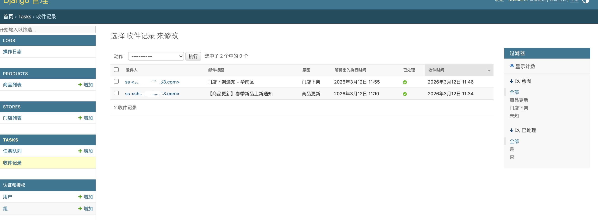
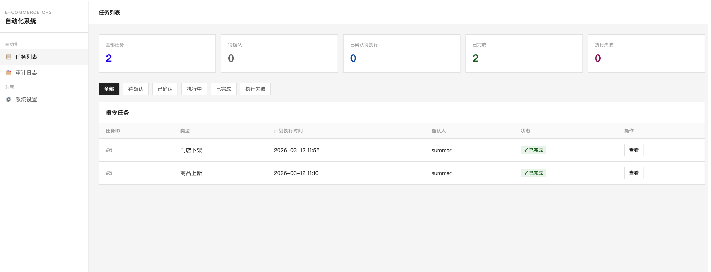
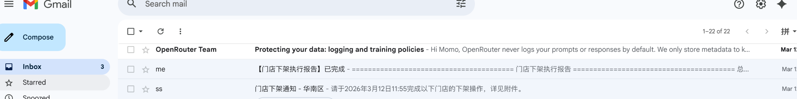
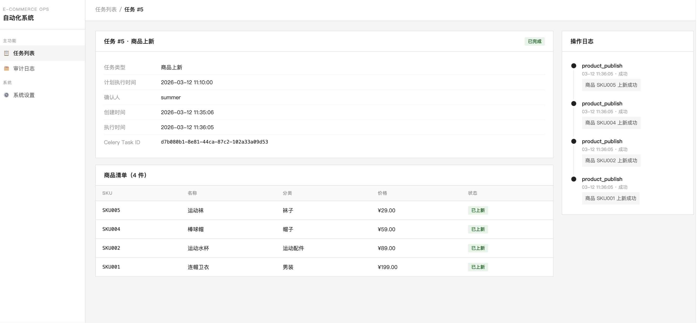

# 电商 AI Agent 自动化系统

> 用 AI Agent 替代人工重复操作——邮件触发、智能解析、定时执行、全程可追溯。

---

## 项目简介

电商运营团队日常需要处理大量重复性工作：收到总部邮件 → 读取 Excel → 逐条录入系统 → 人工去官网验证 -> 发邮件回复总部。本项目用 AI Agent 替代这套流程，运营只需做一件事：**在后台点击确认**。

### 两个核心 Agent

| Agent | 触发方式 | 核心能力 |
|-------|---------|---------|
| 🛍 商品批量上新 | 邮件 + Excel 附件 | 解析意图 → 校验字段 → 定时上新 → Playwright 截图验证 → 自动回复报告给总部 |
| 🏪 门店批量下架 | 邮件 + Excel 附件 | 解析意图 → LangGraph 编排 → API 下架 → Playwright 截图留存 → 自动回复报告给总部 |

---

## 技术栈

| 层 | 技术 |
|----|------|
| AI / Agent | Claude API (via OpenRouter), LangGraph, LangChain |
| 任务调度 | Celery 5.x + Redis + Celery Beat（每 60 秒轮询邮件）|
| Web / 后台 | Django 4.x + 自定义 /ops/ 运营界面 + /admin/ + MySQL 8.0 |
| 浏览器自动化 | Playwright (headless Chromium) |
| 邮件 | imaplib（收件）+ smtplib（发件）|
| 数据处理 | pandas + openpyxl |
| 容器化 | Docker + docker-compose |

---

## 项目截图









---

## 本地启动

### 环境要求

- Python 3.10+
- Docker Desktop（运行 MySQL + Redis）
- Gmail 账号 + App Password

### 1. 克隆项目

```bash
git clone https://github.com/[你的用户名]/ecommerce-agent-system.git
cd ecommerce-agent-system
```

### 2. 配置环境变量

```bash
cp .env.example .env
# 编辑 .env，填入以下配置：
# OPENROUTER_API_KEY=sk-or-v1-xxxxxxxx
# EMAIL_ADDRESS=your@gmail.com
# EMAIL_PASSWORD=xxxx xxxx xxxx xxxx  ← Gmail App Password（无空格）
# DB_PASSWORD=your_password
```

### 3. 安装依赖

```bash
python3 -m venv .venv
source .venv/bin/activate
pip install -r requirements.txt
playwright install chromium
```

### 4. 启动基础服务

```bash
docker compose up -d db redis
python3 manage.py migrate
python3 manage.py createsuperuser
```

### 5. 启动三个服务

```bash
# Terminal 1：Django
source .venv/bin/activate
python3 manage.py runserver

# Terminal 2：Celery Worker
source .venv/bin/activate
celery -A config worker --loglevel=info

# Terminal 3：Celery Beat（邮件轮询）
source .venv/bin/activate
celery -A config beat --loglevel=info
```

### 6. 访问后台

打开 http://127.0.0.1:8000/ops/，用账号登录进入运营后台。

> 技术团队管理入口：http://127.0.0.1:8000/admin/

### 7. 触发测试

发送一封邮件到你配置的 Gmail 地址：

```
标题：【商品更新】测试上新
正文：请于[当前时间+10分钟]完成以下商品的上新工作，附件为商品清单。
附件：data/sample_products.csv
```

60 秒内 Beat 会自动检测到邮件，在 Admin 任务队列确认后，Celery 到点执行。

---

## License

MIT